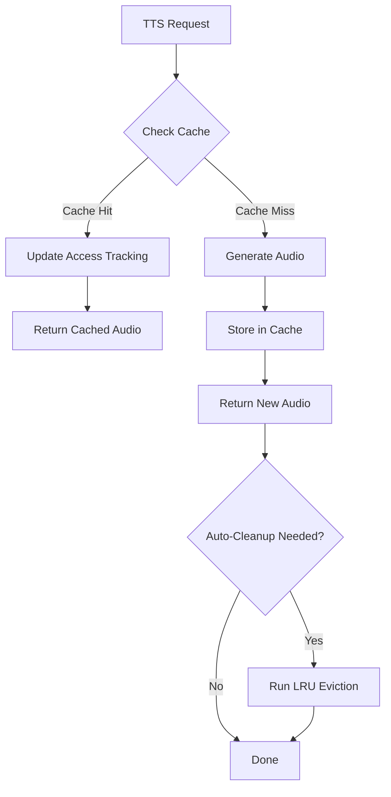

# Audio Caching Strategy Documentation

## Overview

The Remrin.ai audio caching system provides intelligent, production-ready caching for TTS-generated audio with automatic cleanup, LRU eviction, and comprehensive analytics.

## Architecture

### Components

1. **AudioCacheManager** (`/lib/audio/AudioCacheManager.ts`)
   - Core caching logic
   - LRU eviction strategy
   - Atomic operations
   - Access tracking

2. **Hash Utilities** (`/lib/audio/utils/hash.ts`)
   - Deterministic hash generation
   - MD5 for cache keys
   - SHA-256 for secure scenarios

3. **Cache Stats API** (`/app/api/audio/cache/stats/route.ts`)
   - Admin-only statistics endpoint
   - Real-time cache monitoring

## Caching Strategy

### 1. Cache Lookup Flow



### 2. Hash Generation

The cache key is generated from:
- Text content (normalized, lowercased)
- Voice ID
- Voice provider
- Voice settings (sorted for consistency)

```typescript
const hash = createTextHash(
  "Hello, welcome to Remrin!",
  "en-US-AriaNeural",
  { rate: 1.0, pitch: 0 }
);
// Returns: "a1b2c3d4e5f6..."
```

### 3. Cache Storage

Audio files are stored in:
- **Database**: `audio_cache` table (metadata)
- **Storage**: Supabase Storage `audio_cache` bucket (files)

### 4. Access Tracking

Every cache hit updates:
- `last_accessed_at` - Timestamp for LRU
- `access_count` - Total hits for analytics

### 5. Eviction Strategy

**LRU (Least Recently Used)** eviction triggers when:
- Total entries exceed `maxEntries` (default: 10,000)
- Total size exceeds `maxSizeBytes` (default: 10GB)
- Entries older than `maxAgeHours` (default: 720h / 30 days)

## Usage Examples

### Basic Caching

```typescript
import { getAudioCache } from '@/lib/audio/AudioCacheManager';
import { createTextHash } from '@/lib/audio/utils/hash';

async function getTTSAudio(text: string, voiceId: string) {
  const cache = getAudioCache();
  const hash = createTextHash(text, voiceId);
  
  // Check cache first
  const cached = await cache.get(hash);
  if (cached) {
    console.log('Cache hit!');
    return cached.audioUrl;
  }
  
  // Generate new audio
  const audioUrl = await generateTTS(text, voiceId);
  
  // Store in cache
  await cache.set(hash, audioUrl, {
    voiceId,
    voiceProvider: 'edge',
    fileSize: 12345,
    duration: 3.5,
  });
  
  return audioUrl;
}
```

### Cache Warming

Preload common phrases for instant playback:

```typescript
const cache = getAudioCache();

await cache.warmCache([
  {
    text: "Hello! Welcome to Remrin.",
    voiceId: "en-US-AriaNeural",
    voiceProvider: "edge",
    generateFn: async () => ({
      url: await generateTTS("Hello! Welcome to Remrin.", "en-US-AriaNeural"),
      size: 8192,
      duration: 2.1,
    }),
  },
  {
    text: "How can I help you today?",
    voiceId: "en-US-AriaNeural",
    voiceProvider: "edge",
    generateFn: async () => ({
      url: await generateTTS("How can I help you today?", "en-US-AriaNeural"),
      size: 9216,
      duration: 2.5,
    }),
  },
]);
```

### Manual Cleanup

```typescript
const cache = getAudioCache();

// Clean entries older than 7 days
const stats = await cache.cleanup(7 * 24); // hours

console.log(`Deleted ${stats.deletedCount} entries`);
console.log(`Freed ${stats.freedBytes} bytes`);
```

### Get Statistics

```typescript
const cache = getAudioCache();
const stats = await cache.getStats();

console.log(`Total entries: ${stats.totalEntries}`);
console.log(`Total size: ${stats.totalSize} bytes`);
console.log(`Hit rate: ${stats.hitRate}`);
console.log(`Top voice: ${stats.topVoices[0].voiceId}`);
```

## API Integration

### TTS Generation with Caching

```typescript
// app/api/audio/generate/route.ts
import { getAudioCache } from '@/lib/audio/AudioCacheManager';
import { createTextHash } from '@/lib/audio/utils/hash';

export async function POST(request: Request) {
  const { text, voiceId, provider } = await request.json();
  
  const cache = getAudioCache();
  const hash = createTextHash(text, voiceId);
  
  // Try cache first
  const cached = await cache.get(hash);
  if (cached) {
    return Response.json({
      success: true,
      audioUrl: cached.audioUrl,
      cached: true,
      duration: cached.duration,
    });
  }
  
  // Generate new audio
  const result = await generateAudio(text, voiceId, provider);
  
  // Cache the result
  await cache.set(hash, result.url, {
    voiceId,
    voiceProvider: provider,
    fileSize: result.size,
    duration: result.duration,
  });
  
  return Response.json({
    success: true,
    audioUrl: result.url,
    cached: false,
    duration: result.duration,
  });
}
```

## Performance Optimization

### Database Indexes

The following indexes optimize cache operations:

```sql
-- Fast hash lookups (O(log n))
CREATE INDEX idx_audio_cache_text_hash ON audio_cache(text_hash);

-- LRU eviction queries
CREATE INDEX idx_audio_cache_last_accessed ON audio_cache(last_accessed_at);

-- Persona-specific queries
CREATE INDEX idx_audio_cache_persona_id ON audio_cache(persona_id);

-- Provider filtering
CREATE INDEX idx_audio_cache_voice_provider ON audio_cache(voice_provider);
```

### Atomic Operations

All cache operations use atomic database transactions to prevent race conditions:

```typescript
// Atomic access tracking update
await supabase
  .from('audio_cache')
  .update({
    last_accessed_at: new Date().toISOString(),
    access_count: (entry.access_count || 0) + 1,
  })
  .eq('id', entry.id);
```

### Auto-Cleanup

Automatic cleanup runs after each `set()` operation if limits are exceeded:

```typescript
private async autoCleanup(): Promise<void> {
  const stats = await this.getStats();
  
  const needsCleanup =
    stats.totalEntries > this.config.maxEntries ||
    stats.totalSize > this.config.maxSizeBytes;
  
  if (needsCleanup) {
    await this.cleanup();
  }
}
```

## Monitoring & Analytics

### Cache Statistics Endpoint

**GET** `/api/audio/cache/stats` (Admin only)

Response:
```json
{
  "success": true,
  "stats": {
    "totalEntries": 1234,
    "totalSize": 52428800,
    "totalSizeFormatted": "50.00 MB",
    "hitRate": "3.45",
    "oldestEntry": "2026-01-01T00:00:00.000Z",
    "newestEntry": "2026-01-08T12:00:00.000Z",
    "averageFileSize": 42496,
    "averageFileSizeFormatted": "41.50 KB",
    "topVoices": [
      { "voiceId": "en-US-AriaNeural", "count": 456 },
      { "voiceId": "en-GB-SoniaNeural", "count": 234 }
    ]
  }
}
```

### Metrics to Monitor

1. **Hit Rate**: `access_count / total_entries`
   - Target: > 2.0 (each entry used at least twice)

2. **Cache Size**: Total bytes stored
   - Alert if > 90% of `maxSizeBytes`

3. **Eviction Rate**: Entries deleted per hour
   - High rate indicates cache thrashing

4. **Top Voices**: Most frequently cached voices
   - Optimize voice selection based on usage

## Error Handling

### Graceful Degradation

Cache failures never break TTS generation:

```typescript
async get(textHash: string): Promise<CachedAudio | null> {
  try {
    // ... cache logic
  } catch (error) {
    console.error('[AudioCacheManager] Error:', error);
    return null; // Fail gracefully
  }
}
```

### Error Recovery

Cleanup errors are logged but don't throw:

```typescript
private async autoCleanup(): Promise<void> {
  try {
    await this.cleanup();
  } catch (error) {
    console.error('[AudioCacheManager] Auto-cleanup failed:', error);
    // Don't throw - cleanup failure shouldn't break caching
  }
}
```

## Configuration

### Default Settings

```typescript
const cache = new AudioCacheManager({
  maxEntries: 10000,        // Maximum cache entries
  maxSizeBytes: 10 * 1024 * 1024 * 1024, // 10GB
  maxAgeHours: 720,         // 30 days
});
```

### Environment-Specific Config

```typescript
// Production: Larger cache
const prodCache = new AudioCacheManager({
  maxEntries: 50000,
  maxSizeBytes: 50 * 1024 * 1024 * 1024, // 50GB
  maxAgeHours: 2160, // 90 days
});

// Development: Smaller cache
const devCache = new AudioCacheManager({
  maxEntries: 1000,
  maxSizeBytes: 1 * 1024 * 1024 * 1024, // 1GB
  maxAgeHours: 168, // 7 days
});
```

## Best Practices

### 1. Always Check Cache First

```typescript
// ✅ Good
const cached = await cache.get(hash);
if (cached) return cached.audioUrl;
const audio = await generateTTS(text);

// ❌ Bad
const audio = await generateTTS(text);
await cache.set(hash, audio);
```

### 2. Use Consistent Hashing

```typescript
// ✅ Good - Normalized inputs
const hash = createTextHash(
  text.trim().toLowerCase(),
  voiceId.trim(),
  sortedSettings
);

// ❌ Bad - Inconsistent inputs
const hash = createTextHash(text, voiceId, settings);
```

### 3. Include All Voice Parameters

```typescript
// ✅ Good - All parameters affect output
const hash = createTextHash(text, voiceId, {
  rate: 1.0,
  pitch: 0,
  volume: 100,
});

// ❌ Bad - Missing parameters
const hash = createTextHash(text, voiceId);
```

### 4. Monitor Cache Performance

```typescript
// Set up periodic monitoring
setInterval(async () => {
  const stats = await cache.getStats();
  
  if (stats.totalSize > 0.9 * maxSize) {
    console.warn('Cache nearly full!');
  }
  
  if (stats.hitRate < 2.0) {
    console.warn('Low cache hit rate!');
  }
}, 60000); // Every minute
```

## Maintenance

### Scheduled Cleanup

Use a cron job or scheduled task:

```typescript
// Run daily at 3 AM
cron.schedule('0 3 * * *', async () => {
  const cache = getAudioCache();
  const stats = await cache.cleanup();
  
  console.log(`Daily cleanup: ${stats.deletedCount} entries deleted`);
  console.log(`Freed: ${stats.freedBytes} bytes`);
});
```

### Database Maintenance

```sql
-- Run weekly
VACUUM ANALYZE audio_cache;

-- Run monthly
REINDEX INDEX CONCURRENTLY idx_audio_cache_text_hash;
```

## Security Considerations

1. **Admin-Only Stats**: Cache statistics are admin-only to prevent information disclosure
2. **Hash Collisions**: MD5 is sufficient for cache keys (not cryptographic use)
3. **RLS Policies**: Row-level security prevents unauthorized access
4. **File Size Limits**: 10MB per file prevents abuse

## Future Enhancements

- [ ] CDN integration for global distribution
- [ ] Compression for smaller file sizes
- [ ] Multi-region replication
- [ ] Cache warming based on analytics
- [ ] Predictive preloading
- [ ] Real-time cache metrics dashboard
