# Remrin Social Network - Database Architecture

## Overview

This document describes the complete database architecture for Remrin's social networking features. The schema is designed to support millions of users with a read-heavy workload, implementing privacy-first principles and comprehensive Row Level Security (RLS) policies.

## Database Schema Diagram

```mermaid
erDiagram
    %% Core User Tables (Existing)
    auth_users ||--o{ user_profiles : "has"
    auth_users ||--o{ posts : "creates"
    auth_users ||--o{ user_follows : "follows"
    auth_users ||--o{ messages : "sends"
    
    %% Posts & Feed System
    posts ||--o{ post_reactions : "receives"
    posts ||--o{ post_comments : "has"
    posts ||--o{ post_shares : "shared_as"
    posts ||--o| personas : "showcases"
    posts ||--o| achievements : "shares"
    posts ||--o{ post_analytics : "tracked_by"
    
    %% Engagement System
    post_comments ||--o{ post_comments : "replies_to"
    auth_users ||--o{ post_reactions : "reacts"
    auth_users ||--o{ post_comments : "comments"
    auth_users ||--o{ post_shares : "shares"
    
    %% Analytics System
    auth_users ||--o{ profile_views : "viewed_by"
    auth_users ||--o{ follower_growth : "tracks"
    auth_users ||--o{ activity_heatmap : "activity"
    
    %% Highlights System
    auth_users ||--o{ pinned_posts : "pins"
    posts ||--o{ pinned_posts : "pinned_as"
    auth_users ||--o{ featured_achievements : "features"
    achievements ||--o{ featured_achievements : "featured_in"
    auth_users ||--o{ showcase_items : "showcases"
    
    %% Notifications System
    auth_users ||--o{ notifications : "receives"
    auth_users ||--o{ notification_preferences : "configures"
    
    %% Customization System
    auth_users ||--o{ custom_themes : "creates"
    auth_users ||--o| layout_preferences : "has"
    
    %% Profile System (Existing)
    auth_users ||--o{ user_achievements : "earns"
    achievements ||--o{ user_achievements : "earned_by"
    auth_users ||--o{ social_links : "has"
    auth_users ||--o{ featured_creations : "features"
    personas ||--o{ featured_creations : "featured_in"
    auth_users ||--o{ profile_themes : "customizes"
    auth_users ||--o{ profile_analytics : "analytics"
```



## Table Relationships

### Posts & Feed System

#### `posts`
**Purpose**: Core content table for user-generated posts

**Key Fields**:
- `user_id`: Post author (FK to `auth.users`)
- `content`: Post text content
- `media_urls`: Array of image/video URLs
- `post_type`: Enum (`text`, `image`, `character_showcase`, `achievement_share`)
- `visibility`: Enum (`public`, `followers`, `private`)
- `persona_id`: Optional character showcase (FK to `personas`)
- `achievement_id`: Optional achievement share (FK to `achievements`)

**Relationships**:
- Belongs to `auth.users` (author)
- Optionally references `personas` (character showcase)
- Optionally references `achievements` (achievement share)
- Has many `post_reactions`, `post_comments`, `post_shares`

**Indexes**:
- `idx_posts_user_id`: Fast user post queries
- `idx_posts_created_at`: Chronological feed sorting
- `idx_posts_user_created`: Combined index for user timeline
- `idx_posts_visibility`: Filter by visibility level
- `idx_posts_type`: Filter by post type

**RLS Policies**:
- Public posts viewable by everyone
- Follower posts viewable by followers only
- Private posts viewable by author only
- Users can CRUD their own posts

---

### Engagement System

#### `post_reactions`
**Purpose**: Track user reactions to posts (like, love, celebrate, insightful)

**Key Fields**:
- `post_id`: Target post (FK to `posts`)
- `user_id`: User who reacted (FK to `auth.users`)
- `reaction_type`: Enum (`like`, `love`, `celebrate`, `insightful`)

**Constraints**:
- `UNIQUE(post_id, user_id)`: One reaction per user per post

**RLS Policies**:
- Anyone can view reactions
- Users can add/remove their own reactions

#### `post_comments`
**Purpose**: Comments on posts with 1-level nested replies

**Key Fields**:
- `post_id`: Target post (FK to `posts`)
- `user_id`: Comment author (FK to `auth.users`)
- `parent_comment_id`: Optional parent comment for replies (FK to `post_comments`)
- `content`: Comment text
- `mentioned_users`: Array of mentioned user IDs

**Constraints**:
- CHECK: Prevents nesting beyond 1 level (replies can't have replies)

**RLS Policies**:
- Comments viewable if post is viewable
- Users can CRUD their own comments

#### `post_shares`
**Purpose**: Repost/share functionality

**Key Fields**:
- `post_id`: Shared post (FK to `posts`)
- `user_id`: User who shared (FK to `auth.users`)
- `commentary`: Optional text added to share

**Constraints**:
- `UNIQUE(post_id, user_id)`: One share per user per post

**RLS Policies**:
- Anyone can view shares
- Users can create/delete their own shares

---

### Analytics System

#### `profile_views`
**Purpose**: Track profile view counts with privacy

**Key Fields**:
- `profile_user_id`: Profile being viewed (FK to `auth.users`)
- `viewer_user_id`: User viewing (FK to `auth.users`, nullable for anonymous)
- `view_date`: Date of view (for daily aggregation)
- `view_count`: Number of views on this date

**Constraints**:
- `UNIQUE(profile_user_id, viewer_user_id, view_date)`: Daily aggregation

**RLS Policies**:
- Users can only view their own profile view data
- System can insert views (via service role)

#### `post_analytics`
**Purpose**: Detailed post engagement metrics

**Key Fields**:
- `post_id`: Target post (FK to `posts`)
- `metric_date`: Date of metrics
- `views`, `reactions`, `comments`, `shares`: Engagement counts
- `engagement_rate`: Calculated engagement percentage

**Constraints**:
- `UNIQUE(post_id, metric_date)`: Daily metrics per post

**RLS Policies**:
- Post owners can view their analytics
- System manages analytics data

#### `follower_growth`
**Purpose**: Historical follower count tracking

**Key Fields**:
- `user_id`: User being tracked (FK to `auth.users`)
- `growth_date`: Date of snapshot
- `follower_count`, `following_count`: Counts at this date
- `net_change`: Daily change in followers

**Constraints**:
- `UNIQUE(user_id, growth_date)`: Daily snapshots

**RLS Policies**:
- Users can view their own growth data
- System manages growth tracking

#### `activity_heatmap`
**Purpose**: User activity patterns by hour and day

**Key Fields**:
- `user_id`: User being tracked (FK to `auth.users`)
- `activity_date`: Date of activity
- `hour_of_day`: Hour (0-23)
- `activity_count`: Number of activities in this hour
- `activity_types`: JSONB breakdown by activity type

**Constraints**:
- `UNIQUE(user_id, activity_date, hour_of_day)`: Hourly aggregation
- `CHECK(hour_of_day >= 0 AND hour_of_day <= 23)`: Valid hour range

**RLS Policies**:
- Users can view their own activity data
- System manages activity tracking

---

### Highlights System

#### `pinned_posts`
**Purpose**: User-selected pinned posts (max 3)

**Key Fields**:
- `user_id`: Profile owner (FK to `auth.users`)
- `post_id`: Pinned post (FK to `posts`)
- `display_order`: Order (0-2)

**Constraints**:
- `UNIQUE(user_id, post_id)`: Can't pin same post twice
- `UNIQUE(user_id, display_order)`: Unique order per user
- `CHECK(display_order >= 0 AND display_order <= 2)`: Max 3 pins

**RLS Policies**:
- Anyone can view pinned posts
- Users can manage their own pins

#### `featured_achievements`
**Purpose**: Showcase specific achievements

**Key Fields**:
- `user_id`: Profile owner (FK to `auth.users`)
- `achievement_id`: Featured achievement (FK to `achievements`)
- `display_order`: Display order

**Constraints**:
- `UNIQUE(user_id, achievement_id)`: Can't feature same achievement twice
- `UNIQUE(user_id, display_order)`: Unique order per user

**RLS Policies**:
- Anyone can view featured achievements
- Users can manage their own featured achievements

#### `showcase_items`
**Purpose**: Generic showcase system for polymorphic content

**Key Fields**:
- `user_id`: Profile owner (FK to `auth.users`)
- `item_type`: Enum (`post`, `achievement`, `persona`, `custom`)
- `item_id`: ID of showcased item (polymorphic)
- `title`, `description`, `thumbnail_url`: Display metadata
- `metadata`: JSONB for flexible data

**Constraints**:
- `UNIQUE(user_id, item_type, item_id)`: Can't showcase same item twice

**RLS Policies**:
- Anyone can view showcase items
- Users can manage their own showcase

---

### Notifications System

#### `notifications`
**Purpose**: Unified notification system

**Key Fields**:
- `user_id`: Notification recipient (FK to `auth.users`)
- `actor_id`: User who triggered notification (FK to `auth.users`)
- `notification_type`: Enum (see migration for full list)
- `entity_type`, `entity_id`: Polymorphic reference to related entity
- `title`, `message`: Notification content
- `action_url`: Deep link to related content
- `is_read`: Read status
- `read_at`: Timestamp when marked read

**Notification Types**:
- `follow`: New follower
- `post_reaction`: Someone reacted to your post
- `comment`: Someone commented on your post
- `mention`: Someone mentioned you
- `share`: Someone shared your post
- `achievement_earned`: New achievement unlocked
- `post_comment_reply`: Reply to your comment
- `milestone`: Milestone reached

**RLS Policies**:
- Users can view/update/delete their own notifications
- System can create notifications

#### `notification_preferences`
**Purpose**: User-configurable notification settings

**Key Fields**:
- `user_id`: User (FK to `auth.users`)
- `notification_type`: Type to configure
- `enabled`: Master toggle
- `email_enabled`: Email notifications
- `push_enabled`: Push notifications

**Constraints**:
- `UNIQUE(user_id, notification_type)`: One preference per type per user

**RLS Policies**:
- Users can manage their own preferences

---

### Customization System

#### `custom_themes`
**Purpose**: Enhanced theme customization

**Key Fields**:
- `user_id`: Theme creator (FK to `auth.users`)
- `theme_name`: Theme name
- `primary_color`, `secondary_color`, `accent_color`, etc.: Color scheme
- `font_family`: Font selection
- `custom_css`: Advanced custom CSS
- `is_active`: Currently active theme
- `is_public`: Shareable with community
- `use_count`: Popularity tracking

**RLS Policies**:
- Public themes viewable by everyone
- Users can view/manage their own themes

#### `layout_preferences`
**Purpose**: User layout customization

**Key Fields**:
- `user_id`: User (FK to `auth.users`)
- `layout_type`: Enum (`grid`, `list`, `masonry`)
- `section_order`: JSONB array of section order
- `visible_sections`: JSONB object of section visibility
- `posts_per_page`: Pagination size (5-50)

**Constraints**:
- `UNIQUE(user_id)`: One layout preference per user
- `CHECK(posts_per_page >= 5 AND posts_per_page <= 50)`: Valid pagination

**RLS Policies**:
- Users can manage their own layout preferences

---

## Design Decisions

### 1. Privacy-First Architecture

**Decision**: Implement comprehensive RLS policies on all tables

**Rationale**:
- Protects user data at the database level
- Prevents accidental data leaks in application code
- Respects user privacy settings (public/followers/private)
- Enables secure direct database access from frontend

**Implementation**:
- All tables have RLS enabled
- Policies check user authentication via `auth.uid()`
- Post visibility enforced through RLS, not application logic
- Analytics data only viewable by data owner

### 2. Polymorphic Relationships

**Decision**: Use `item_type` + `item_id` pattern for flexible relationships

**Rationale**:
- `showcase_items` can reference posts, achievements, personas, or custom content
- `notifications` can reference any entity type
- Avoids creating separate tables for each relationship type
- Enables future extensibility without schema changes

**Trade-offs**:
- Can't use foreign key constraints on polymorphic IDs
- Requires application-level validation
- More complex queries

### 3. Denormalized View Counts

**Decision**: Store `view_count` directly on `posts` table

**Rationale**:
- Read-heavy workload: view counts displayed frequently
- Avoids expensive COUNT queries on every post load
- Can be updated asynchronously via background jobs
- Acceptable eventual consistency for view counts

**Implementation**:
- `increment_post_views()` function for atomic updates
- Background job aggregates `post_analytics` into `view_count`

### 4. Daily Aggregation for Analytics

**Decision**: Aggregate analytics data by day, not real-time

**Rationale**:
- Reduces database writes (batch updates)
- Sufficient granularity for most analytics use cases
- Enables efficient time-series queries
- Privacy-friendly (less granular tracking)

**Implementation**:
- `UNIQUE(user_id, metric_date)` constraints
- Background jobs aggregate hourly/daily
- Indexed on date columns for fast range queries

### 5. Nested Comments Limited to 1 Level

**Decision**: Allow replies to comments, but not replies to replies

**Rationale**:
- Simplifies UI/UX (avoids deep nesting)
- Reduces query complexity
- Sufficient for most social interactions
- Can be extended later if needed

**Implementation**:
- CHECK constraint prevents nesting beyond 1 level
- `parent_comment_id` can only reference top-level comments

### 6. Reaction Types as Enum

**Decision**: Use CHECK constraint for reaction types instead of separate table

**Rationale**:
- Fixed set of reactions (like, love, celebrate, insightful)
- Unlikely to change frequently
- Simpler queries (no JOIN required)
- Better performance

**Trade-offs**:
- Requires migration to add new reaction types
- Can't store per-reaction metadata easily

### 7. JSONB for Flexible Data

**Decision**: Use JSONB for `metadata`, `settings`, `activity_types`

**Rationale**:
- Flexible schema for evolving requirements
- Avoids frequent migrations for new fields
- Supports complex nested data structures
- PostgreSQL JSONB is performant and indexable

**Use Cases**:
- `customization_json`: User preferences
- `metadata`: Notification/showcase metadata
- `activity_types`: Activity breakdown in heatmap
- `section_order`: Layout configuration

---

## Scalability Considerations

### Indexing Strategy

**Read-Heavy Optimization**:
- All foreign keys indexed
- Composite indexes for common query patterns
- `created_at DESC` indexes for chronological feeds
- Covering indexes where beneficial

**Key Indexes**:
```sql
-- User timeline
idx_posts_user_created (user_id, created_at DESC)

-- Feed generation
idx_posts_created_at (created_at DESC)
idx_posts_visibility (visibility)

-- Engagement queries
idx_post_reactions_post_id (post_id)
idx_post_comments_post_id (post_id, created_at)

-- Analytics
idx_profile_analytics_user_date (user_id, date DESC)
idx_post_analytics_post_id (post_id, metric_date DESC)
```

### Partitioning Strategy (Future)

**When to Partition**:
- `posts`: When > 10M rows, partition by `created_at` (monthly)
- `notifications`: When > 50M rows, partition by `created_at` (weekly)
- `post_analytics`: Partition by `metric_date` (monthly)
- `activity_heatmap`: Partition by `activity_date` (monthly)

**Benefits**:
- Faster queries on recent data
- Easier archival of old data
- Improved vacuum performance

### Caching Strategy

**Application-Level Caching**:
- User profiles: 5-minute TTL
- Post feeds: 1-minute TTL
- Follower counts: 10-minute TTL
- Analytics: 1-hour TTL

**Database-Level Caching**:
- Materialized views for trending posts
- Aggregate follower counts
- Popular hashtags/topics

### Background Jobs

**Async Processing**:
- View count aggregation (every 5 minutes)
- Analytics calculation (hourly)
- Follower growth snapshots (daily)
- Notification batching (every 1 minute)

---

## Privacy & Security Approach

### Row Level Security (RLS)

**Principle**: Database enforces privacy, not application code

**Implementation**:
1. **Public Data**: Viewable by everyone (public posts, reactions, shares)
2. **Follower-Only Data**: Viewable by followers (follower posts)
3. **Private Data**: Viewable by owner only (private posts, analytics, notifications)
4. **System Data**: Managed by service role (analytics aggregation)

### Data Access Patterns

**User Can View**:
- Their own data (always)
- Public posts (always)
- Follower posts (if following)
- Public profiles (if privacy allows)

**User Can Modify**:
- Only their own data
- Exception: System can create notifications

**User Cannot View**:
- Other users' analytics
- Other users' notifications
- Private posts (unless author)

### Privacy Settings

**Inherited from `user_profiles.privacy_settings`**:
```json
{
  "profile": "public|followers|private",
  "analytics": "public|followers|private",
  "badges": "public|followers|private"
}
```

**Respected By**:
- `posts` visibility
- `profile_views` access
- `user_achievements` display
- `featured_creations` visibility

---

## Helper Functions

### `increment_post_views(post_uuid UUID)`
**Purpose**: Atomically increment post view count

**Usage**:
```sql
SELECT increment_post_views('post-uuid-here');
```

### `get_post_engagement(post_uuid UUID)`
**Purpose**: Get aggregated engagement metrics for a post

**Returns**:
- `reactions_count`: Total reactions
- `comments_count`: Total comments
- `shares_count`: Total shares
- `total_engagement`: Sum of all engagement

**Usage**:
```sql
SELECT * FROM get_post_engagement('post-uuid-here');
```

### `get_follower_counts(user_uuid UUID)`
**Purpose**: Get follower/following counts for a user

**Returns**:
- `followers`: Number of followers
- `following`: Number of users followed

**Usage**:
```sql
SELECT * FROM get_follower_counts('user-uuid-here');
```

---

## Migration Instructions

### Prerequisites
- Existing tables: `auth.users`, `personas`, `achievements`, `user_follows`
- PostgreSQL 14+ (for JSONB features)
- Supabase project with RLS enabled

### Application Steps

> [!WARNING]
> This migration must be applied manually via Supabase Dashboard due to existing migration history.

1. **Backup Database**
   ```bash
   # Via Supabase CLI
   supabase db dump -f backup_before_social_network.sql
   ```

2. **Open Supabase Dashboard**
   - Navigate to SQL Editor
   - Create new query

3. **Copy Migration SQL**
   - Copy entire contents of `supabase/migrations/20260111_social_network_schema.sql`
   - Paste into SQL Editor

4. **Execute Migration**
   - Click "Run" button
   - Monitor for errors
   - Verify success message

5. **Verify Tables Created**
   - Navigate to Table Editor
   - Confirm all 15 new tables exist:
     - `posts`
     - `post_reactions`
     - `post_comments`
     - `post_shares`
     - `profile_views`
     - `post_analytics`
     - `follower_growth`
     - `activity_heatmap`
     - `pinned_posts`
     - `featured_achievements`
     - `showcase_items`
     - `notifications`
     - `notification_preferences`
     - `custom_themes`
     - `layout_preferences`

6. **Verify RLS Policies**
   - Check each table has RLS enabled
   - Verify policies exist (see Policies tab)

7. **Verify Indexes**
   - Navigate to Database → Indexes
   - Confirm all indexes created

8. **Test Queries**
   ```sql
   -- Test post creation
   INSERT INTO posts (user_id, content, post_type, visibility)
   VALUES (auth.uid(), 'Test post', 'text', 'public');
   
   -- Test post retrieval
   SELECT * FROM posts WHERE visibility = 'public' LIMIT 10;
   
   -- Test engagement function
   SELECT * FROM get_post_engagement('post-uuid');
   ```

### Rollback Plan

If migration fails:

```sql
-- Drop all new tables (in reverse order due to foreign keys)
DROP TABLE IF EXISTS layout_preferences CASCADE;
DROP TABLE IF EXISTS custom_themes CASCADE;
DROP TABLE IF EXISTS notification_preferences CASCADE;
DROP TABLE IF EXISTS notifications CASCADE;
DROP TABLE IF EXISTS showcase_items CASCADE;
DROP TABLE IF EXISTS featured_achievements CASCADE;
DROP TABLE IF EXISTS pinned_posts CASCADE;
DROP TABLE IF EXISTS activity_heatmap CASCADE;
DROP TABLE IF EXISTS follower_growth CASCADE;
DROP TABLE IF EXISTS post_analytics CASCADE;
DROP TABLE IF EXISTS profile_views CASCADE;
DROP TABLE IF EXISTS post_shares CASCADE;
DROP TABLE IF EXISTS post_comments CASCADE;
DROP TABLE IF EXISTS post_reactions CASCADE;
DROP TABLE IF EXISTS posts CASCADE;

-- Drop helper functions
DROP FUNCTION IF EXISTS increment_post_views(UUID);
DROP FUNCTION IF EXISTS get_post_engagement(UUID);
DROP FUNCTION IF EXISTS get_follower_counts(UUID);
```

---

## Next Steps

### Frontend Integration

1. **Create TypeScript Types**
   ```bash
   # Regenerate Supabase types
   npx supabase gen types typescript --project-id <project-id> > supabase/types.ts
   ```

2. **Implement API Routes**
   - See `docs/API_ENDPOINTS.md` for complete API specifications

3. **Build UI Components**
   - Post composer
   - Feed display
   - Engagement buttons (reactions, comments, shares)
   - Notifications panel
   - Analytics dashboard
   - Theme customizer

### Backend Services

1. **Analytics Aggregation**
   - Cron job to aggregate `post_analytics` daily
   - Update `follower_growth` snapshots
   - Calculate `activity_heatmap` data

2. **Notification Service**
   - Listen to database events (triggers)
   - Create notifications on engagement
   - Batch notification delivery

3. **Content Moderation**
   - Implement content filtering
   - User reporting system
   - Admin moderation tools

---

## Performance Benchmarks

### Expected Query Performance (at scale)

| Query | Rows | Expected Time | Index Used |
|-------|------|---------------|------------|
| User timeline | 1M posts | < 50ms | `idx_posts_user_created` |
| Public feed | 10M posts | < 100ms | `idx_posts_created_at` |
| Post engagement | 1M reactions | < 20ms | `idx_post_reactions_post_id` |
| Follower count | 1M follows | < 10ms | `get_follower_counts()` function |
| Notifications | 10M notifications | < 50ms | `idx_notifications_unread` |

### Optimization Targets

- **P95 latency**: < 200ms for all queries
- **Throughput**: 1000+ reads/sec per table
- **Write latency**: < 100ms for inserts
- **Index hit rate**: > 99%

---

## Conclusion

This database architecture provides a solid foundation for Remrin's social networking features. The schema is designed for scalability, privacy, and performance, with comprehensive RLS policies and strategic indexing.

**Key Strengths**:
- ✅ Privacy-first design with RLS
- ✅ Optimized for read-heavy workload
- ✅ Flexible customization system
- ✅ Comprehensive analytics tracking
- ✅ Extensible notification system

**Future Enhancements**:
- Table partitioning for large tables
- Materialized views for trending content
- Full-text search integration
- Real-time subscriptions via Supabase Realtime
- Advanced recommendation algorithms
